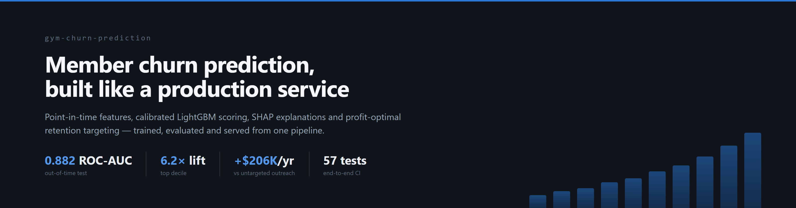
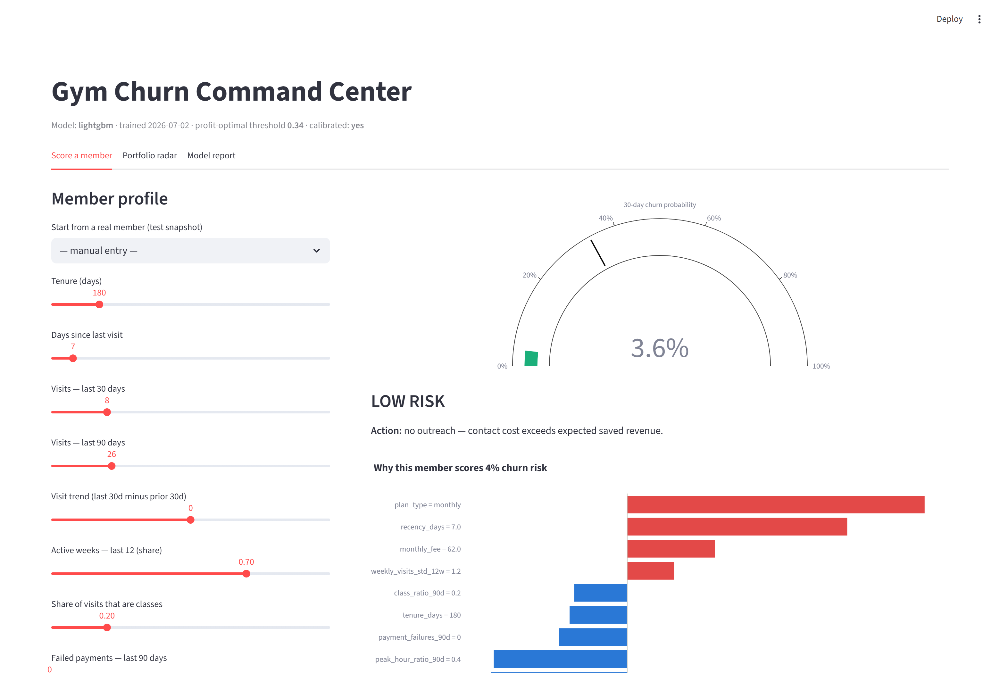
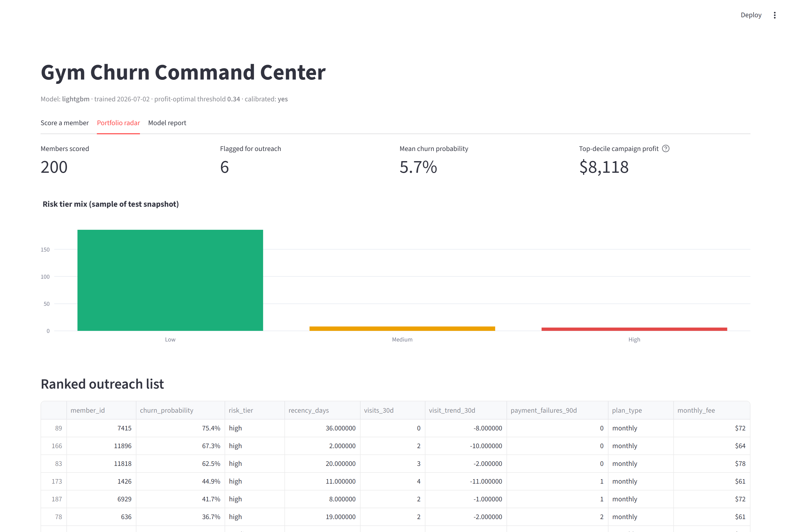
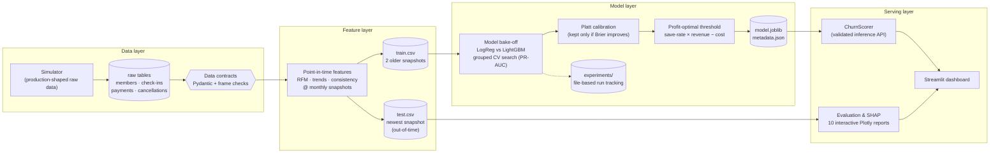
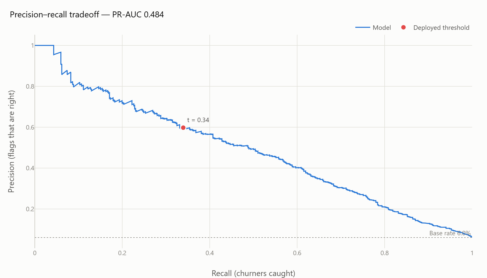
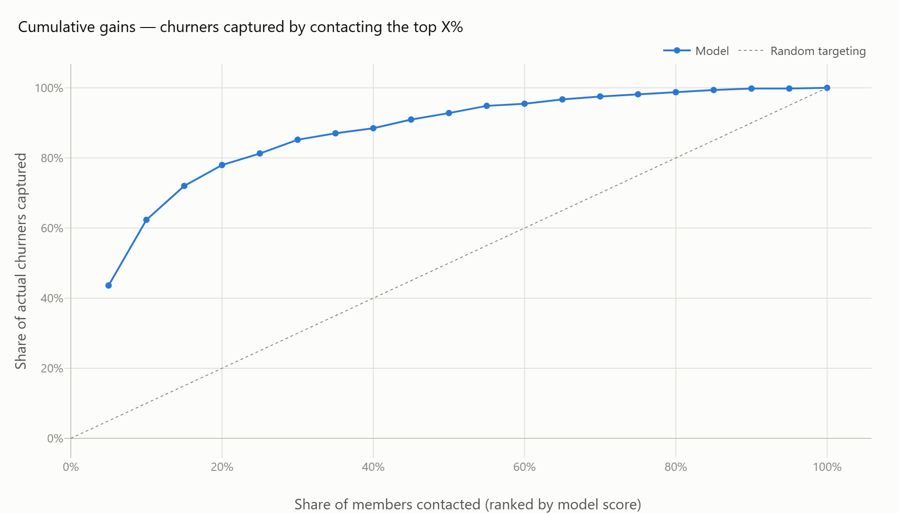
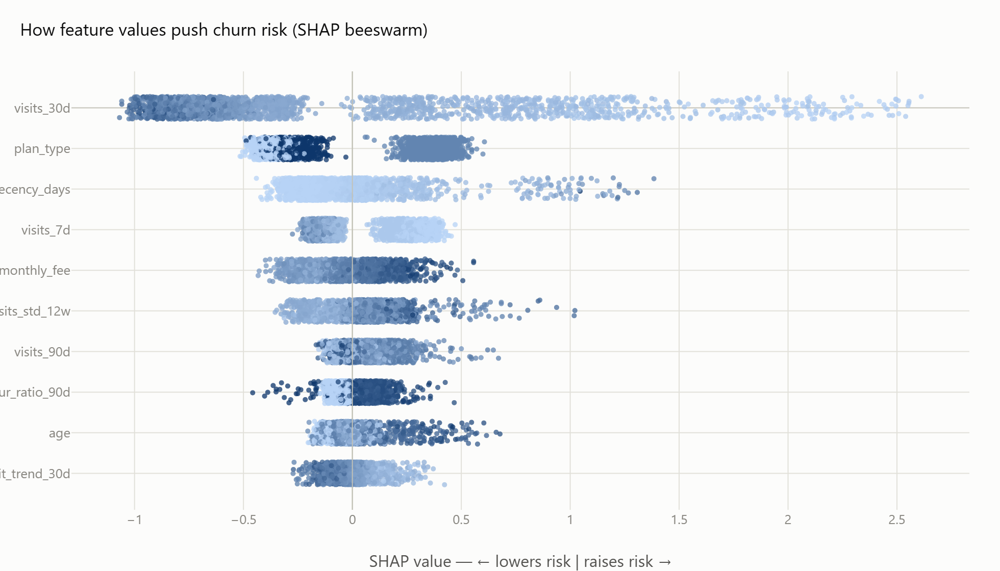
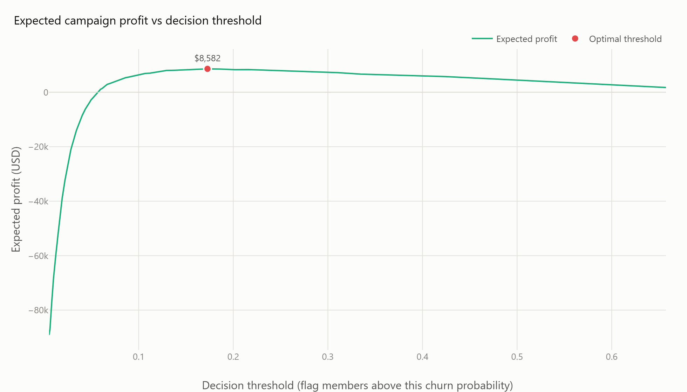
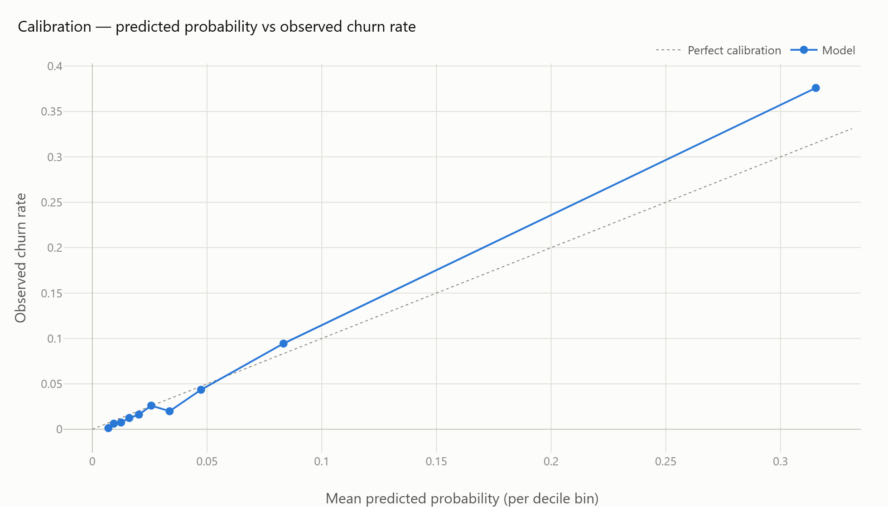
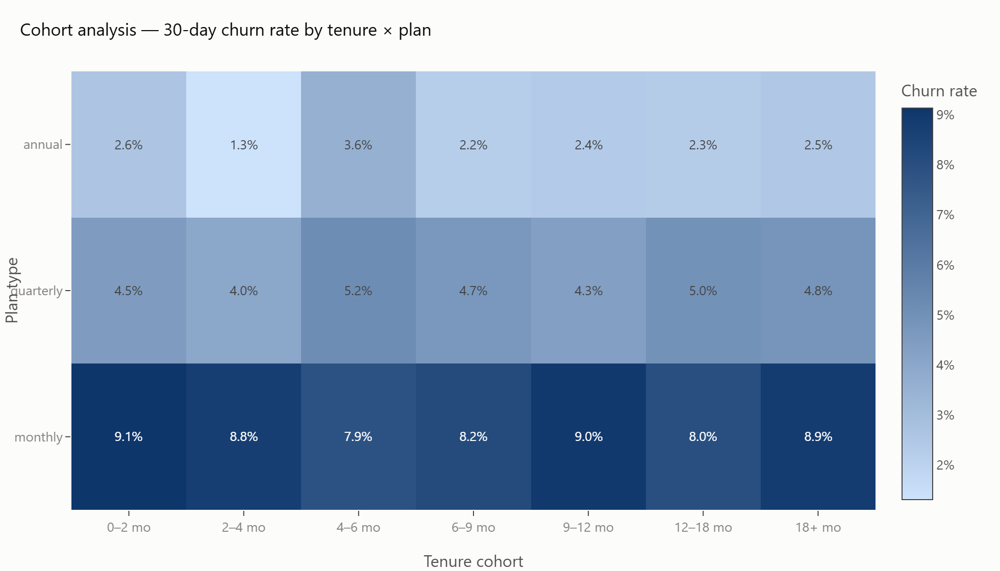

# gym-churn-prediction

[](https://github.com/joaocordova/gym-churn-prediction/actions/workflows/ci.yml)


Production-style ML system that scores every active gym member's probability of cancelling in the next 30 days, explains each score with SHAP, and converts the scores into a retention campaign with a profit-optimal contact threshold. One pipeline covers data generation, validation, feature engineering, training, evaluation, and serving; a Streamlit app is the operator surface.

**Results on the out-of-time test snapshot** (May 2026, 8,231 members the model never saw): ROC-AUC 0.882, PR-AUC 0.484 against a 6.0% base rate, 6.2x lift in the top decile. Targeting the top 10% captures 62% of next-month churners, worth roughly $17,200/month over untargeted outreach on this portfolio (~$206K annualized).

Companion project: [gym-winback-prediction](https://github.com/joaocordova/gym-winback-prediction) — once a member has cancelled, which ones can be won back, and with which offer.

## Dashboard

Per-member scoring with the SHAP explanation for that exact member, and the outreach recommendation derived from campaign economics rather than a fixed 0.5 cutoff:



Portfolio view — risk-tier distribution, ranked outreach list, expected campaign profit:



```bash
streamlit run app.py   # http://localhost:8501
```

## Problem

Gyms lose 30–50% of members per year. Retention outreach (a call, a free session, a discount) works, but only when it reaches members who were actually about to leave. The system answers three questions monthly: who is likely to cancel in the next 30 days; which behaviours drive each member's risk; and for which members the expected saved revenue exceeds the cost of contact.

## Architecture



Design decisions that carry the system:

- **Leakage discipline.** Every feature is computed strictly from data on or before its snapshot date; the label is a cancellation in the following 30 days. Training uses the two older snapshots, evaluation uses the newest — the model is always tested on a month it has never seen. All CV and validation splits are grouped by `member_id`, since the same member appears in several snapshots.
- **Data contracts at every boundary.** Raw tables are validated on write and on read (Pydantic row contracts plus vectorised frame checks and cross-table referential integrity). Inference payloads are validated against a `ScoringRequest` schema, so a malformed row fails loudly instead of mis-scoring silently.
- **Probabilities that can feed arithmetic.** Platt calibration is fitted on one grouped half of the validation split and kept only if it improves the Brier score on the other half. The decision threshold then maximises expected campaign profit (save-rate × retained revenue − contact cost), not F1.
- **Tracked, reproducible training.** Every run writes params, metrics and artifacts under `experiments/runs/` with an append-only JSONL index; the entire pipeline is deterministic under the configured seed.
- **Honest synthetic data.** Real membership data is proprietary, so a simulator generates production-shaped raw tables. Roughly 80% of churners disengage gradually over 8–14 weeks (the learnable signal); the rest cancel abruptly (relocation, health) and are intentionally near-unpredictable, which keeps the evaluation ceiling realistic. Assumptions are documented in [docs/data_generation.md](docs/data_generation.md).

## Stack

| Concern | Choice |
|---|---|
| Data contracts | Pydantic v2 row models, vectorised frame contracts, referential integrity |
| Features | pandas point-in-time snapshot pipeline ([feature dictionary](docs/feature_dictionary.md)) |
| Models | LightGBM vs LogisticRegression bake-off, RandomizedSearchCV + GroupKFold |
| Calibration | Platt scaling, retained only on measured Brier improvement |
| Tracking | file-based run tracker (params/metrics/artifacts + JSONL index) |
| Explainability | SHAP: global beeswarm, per-member waterfall, one-hot aggregated back to business features |
| Reports | Plotly interactive HTML + PNG snapshots |
| Serving | ChurnScorer class + Streamlit operator dashboard |
| Quality | pytest (57 tests incl. a full pipeline run), GitHub Actions CI, Dockerfile |
| Logging | Loguru console + structured JSON-lines audit logs |

## Evaluation

All charts are interactive Plotly HTML under [`assets/`](assets/); static snapshots below.

| | |
|:---:|:---:|
| Precision–recall tradeoff<br> | Cumulative gains and lift<br> |
| SHAP beeswarm — churn drivers<br> | Campaign profit vs threshold<br> |
| Calibration<br> | Churn by tenure cohort × plan<br> |

| Metric (out-of-time test) | Value |
|---|---|
| ROC-AUC | 0.882 |
| PR-AUC | 0.484 (base rate 0.060) |
| Brier score | 0.0415 |
| Precision / recall @ profit threshold (0.34) | 0.596 / 0.337 |
| Precision @ top 10% | 0.376 (6.2x lift) |
| Recall @ top 10% | 0.624 |

Model bake-off on validation PR-AUC: LightGBM 0.468 vs LogisticRegression 0.216. Both candidates, their CV scores and the winning hyperparameters are recorded in `models/metadata.json`.

## Business impact

From `assets/business_impact.json` — test-month portfolio of 8,051 active members ($479K monthly recurring revenue; $30.5K/month lost to churn):

| Strategy | Contacted | Churners caught | Expected profit / month |
|---|---|---|---|
| Model, profit-optimal threshold | 275 (3.4%) | 164 | +$7,027 (ROI 1.7x) |
| Model, top decile | 805 (10%) | 303 | +$8,118 |
| Random targeting, same budget | 805 (10%) | ~49 | −$9,038 |

Assumptions (30% save rate, 3.5 retained months per save, $15 contact cost) are levers in `configs/config.yaml`, so the economics can be re-derived per gym.

## Running the project

```bash
git clone https://github.com/joaocordova/gym-churn-prediction.git && cd gym-churn-prediction
pip install -e ".[app,dev]"       # or: pip install -r requirements.txt

python -m gym_churn.cli all       # simulate -> features -> train -> evaluate -> explain
pytest                            # 57 tests, includes an end-to-end pipeline run
streamlit run app.py
```

Individual stages: `python -m gym_churn.cli simulate|features|train|evaluate|explain`. Make targets: `make pipeline`, `make test`, `make app`.

Docker:

```bash
docker build -t gym-churn .
docker run -p 8501:8501 gym-churn
```

## Limitations and next steps

- **Drift monitoring is out of scope here.** The schema layer catches structural violations, but distribution drift (e.g., a new membership plan shifting the fee distribution) would currently surface only as degraded metrics at the next retrain. A monitoring job comparing live feature distributions against the training snapshot is the natural next component.
- **Retraining cadence is manual.** The pipeline is a single deterministic command, so scheduling it is trivial, but champion/challenger promotion logic is not implemented — the newest model always wins.
- **The save-rate assumption is unvalidated.** The 30% campaign save rate is an industry default; in production it should be estimated from a holdout control group in the first campaign waves, which would also enable uplift modelling instead of pure risk ranking.

## Repository layout

<details>
<summary>Expand</summary>

```
gym-churn-prediction/
├── app.py                      # Streamlit dashboard
├── configs/config.yaml         # single validated source of every tunable
├── src/gym_churn/
│   ├── config.py               # Pydantic-typed config loader (fail-fast)
│   ├── schemas.py              # data contracts: row models + frame contracts
│   ├── simulation.py           # behavioural data simulator
│   ├── features.py             # point-in-time feature layer
│   ├── models.py               # candidates, preprocessing, calibration wrapper
│   ├── train.py                # grouped CV bake-off + calibration + threshold
│   ├── evaluate.py             # metrics + interactive evaluation reports
│   ├── explain.py              # SHAP global + per-member explanations
│   ├── business.py             # probabilities -> dollars (campaign economics)
│   ├── predict.py              # ChurnScorer: validated inference API
│   ├── tracking.py             # file-based experiment tracker
│   ├── plotting.py             # shared chart theming
│   └── cli.py                  # pipeline entry points
├── tests/                      # 57 pytest tests (unit + end-to-end)
├── docs/                       # feature dictionary, data-generation assumptions
├── assets/                     # interactive HTML reports (+ PNG in assets/img)
├── models/                     # model.joblib + metadata.json
├── experiments/                # tracked runs
├── Dockerfile · Makefile · .github/workflows/ci.yml
└── requirements.txt · pyproject.toml
```

</details>

## Documentation

- [docs/feature_dictionary.md](docs/feature_dictionary.md) — every feature, its window, and the business logic behind it
- [docs/data_generation.md](docs/data_generation.md) — the simulator's generative assumptions and why they matter

## License

MIT
