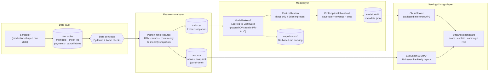

# 🏋️ gym-churn-prediction

**Production-grade churn prediction for gym memberships** — an end-to-end ML system that turns raw check-in, billing and membership data into a calibrated 30-day churn probability, a SHAP explanation of *why*, and a profit-optimal retention campaign.


> **Headline result (out-of-time test):** ROC-AUC **0.882** · PR-AUC **0.484** (8× the 6% base rate) · **6.2× lift** in the top decile. Contacting the top 10% riskiest members captures **62% of next-month churners** and is worth **≈ $17,200/month more profit than untargeted outreach** on a 8,000-member portfolio.

---

## 1. Business problem

Gyms lose 30–50% of members per year. Retention outreach (a call, a free PT session, a discount) works — but only if it lands on members who were actually about to leave, *before* they leave. This system answers three questions every month:

1. **Who** is likely to cancel in the next 30 days?
2. **Why** — which behaviours are driving each member's risk?
3. **Is outreach worth it** — for which members does expected saved revenue exceed campaign cost?

## 2. System architecture



**Leakage discipline:** every feature is computed strictly from data on or before its snapshot date; the label is a cancellation in the 30 days after. Training uses the two older snapshots, evaluation uses the newest — the model is always tested on a month it has never seen, and all CV/validation splits are **grouped by member_id** so no member appears on both sides of any split.

## 3. Tech stack

| Layer | Technology |
|---|---|
| Data contracts | **Pydantic v2** row models + vectorised frame contracts + referential integrity |
| Features | pandas point-in-time snapshot pipeline (documented feature dictionary) |
| Models | **LightGBM** vs scikit-learn LogisticRegression bake-off, `RandomizedSearchCV` + `GroupKFold` |
| Calibration | Platt scaling, kept only when it improves Brier on a held-out half |
| Experiment tracking | file-based MLflow-style tracker (`experiments/` — params, metrics, artifacts, JSONL index) |
| Explainability | **SHAP** (global beeswarm + per-member waterfall, one-hot aggregated back to business features) |
| Visualisation | **Plotly** interactive HTML + PNG snapshots, single validated color system |
| UI | **Streamlit** scoring dashboard |
| Quality | **pytest** (57 tests incl. an end-to-end pipeline run), GitHub Actions CI, Dockerfile |
| Logging | **Loguru** console + structured JSON-lines audit logs |

## 4. Key engineering features

- **Fail-fast config** — one `configs/config.yaml`, fully typed and validated by Pydantic (`gym_churn/config.py`); a bad value dies at load time, not after an hour of training.
- **Data contracts at every boundary** — raw tables are validated on write *and* read; inference payloads are validated against `ScoringRequest` so a malformed row can never silently mis-score.
- **Honest synthetic data** — the simulator (`gym_churn/simulation.py`) encodes a behavioural story: gradual churners disengage over 8–14 weeks (the learnable signal), while ~20% churn abruptly (relocation/health) and are intentionally near-unpredictable, keeping metrics realistic. Assumptions are documented in [`docs/data_generation.md`](docs/data_generation.md).
- **Business-first decision threshold** — the operating point maximises expected campaign profit, not F1. The threshold, the calibration decision and the winning model are all recorded in `models/metadata.json`.
- **Reproducible experiments** — every training run writes params/metrics/artifacts under `experiments/runs/` plus an append-only `index.jsonl`; the whole pipeline is deterministic under `random_seed`.

## 5. Interactive dashboard

```bash
streamlit run app.py
```

Three views:

| Tab | What it does |
|---|---|
| 🎯 **Score a member** | Enter (or preset-load) a member profile → calibrated churn gauge, risk tier, outreach recommendation, and a **SHAP waterfall explaining that exact member** |
| 📡 **Portfolio radar** | Scored portfolio: risk-tier mix, ranked outreach list, expected campaign profit |
| 📊 **Model report** | Headline metrics + all ten interactive evaluation plots, embedded |

## 6. Model performance (out-of-time test — May 2026 snapshot, 8,231 members)

| Metric | Value | Notes |
|---|---|---|
| ROC-AUC | **0.882** | |
| PR-AUC | **0.484** | vs 0.060 base rate → **8.0×** |
| Brier score | **0.0415** | calibrated probabilities |
| Precision @ profit threshold | **0.596** | threshold 0.34, chosen for max profit |
| Recall @ profit threshold | **0.337** | |
| Precision @ top 10% | **0.376** | **6.2× lift** over random |
| Recall @ top 10% | **0.624** | top decile captures 62% of churners |

Candidate bake-off (validation PR-AUC): LightGBM **0.468** > LogisticRegression baseline 0.216 — the boosted model earns its complexity.

<p align="center">
  
  
</p>
<p align="center">
  
  
</p>

Interactive versions of all charts (hover, zoom) live in [`assets/`](assets/) — `roc_curve`, `pr_curve`, `calibration_curve`, `confusion_matrix`, `gains_lift`, `profit_curve`, `score_distribution`, `cohort_churn`, `shap_importance`, `shap_beeswarm`.

## 7. Business impact (from `assets/business_impact.json`)

On the test-month portfolio of **8,051 active members** ($479K monthly recurring revenue, $30.5K/month walking out the door):

| Strategy | Members contacted | Churners caught | Expected profit / month |
|---|---|---|---|
| **Model, profit-optimal threshold** | 275 (3.4%) | 164 (precision 60%) | **+$7,027** (ROI 1.7×) |
| **Model, top decile** | 805 (10%) | 303 (recall 62%) | **+$8,118** |
| Random targeting, same budget | 805 (10%) | ~49 expected | **−$9,038** |

**Model uplift vs untargeted outreach: ≈ $17,200/month (~$206K annualised)**, assuming a 30% save rate, 3.5 retained months per save and $15 contact cost — all levers configurable in `configs/config.yaml` and stress-testable per gym.

## 8. Quickstart

```bash
git clone <repo-url> && cd gym-churn-prediction
pip install -e ".[app,dev]"       # or: pip install -r requirements.txt

python -m gym_churn.cli all       # simulate → features → train → evaluate → explain
pytest                            # 57 tests, includes an end-to-end pipeline run
streamlit run app.py              # launch the dashboard
```

Stage by stage: `python -m gym_churn.cli simulate|features|train|evaluate|explain` (or `make pipeline`, `make test`, `make app`).

### Docker

```bash
docker build -t gym-churn .
docker run -p 8501:8501 gym-churn   # dashboard at http://localhost:8501
```

## 9. Repository layout

```
gym-churn-prediction/
├── app.py                      # Streamlit dashboard
├── configs/config.yaml         # single validated source of every tunable
├── src/gym_churn/
│   ├── config.py               # Pydantic-typed config loader (fail-fast)
│   ├── schemas.py              # data contracts: row models + frame contracts
│   ├── simulation.py           # behavioural data simulator
│   ├── features.py             # point-in-time feature store layer
│   ├── models.py               # candidates, preprocessing, calibration wrapper
│   ├── train.py                # grouped CV bake-off + calibration + threshold
│   ├── evaluate.py             # metrics + 8 interactive evaluation reports
│   ├── explain.py              # SHAP global + per-member explanations
│   ├── business.py             # probabilities → dollars (campaign economics)
│   ├── predict.py              # ChurnScorer: validated inference API
│   ├── tracking.py             # file-based experiment tracker
│   ├── plotting.py             # one validated visual system for every chart
│   └── cli.py                  # pipeline entry points
├── tests/                      # 57 pytest tests (unit + end-to-end)
├── docs/                       # feature dictionary, data-generation assumptions
├── assets/                     # interactive HTML reports (+ PNG in assets/img)
├── models/                     # model.joblib + metadata.json
├── experiments/                # tracked runs (params/metrics/artifacts)
├── Dockerfile · Makefile · .github/workflows/ci.yml
└── requirements.txt · pyproject.toml
```

## 10. Documentation

- [`docs/feature_dictionary.md`](docs/feature_dictionary.md) — every feature, its window, and the business logic behind it
- [`docs/data_generation.md`](docs/data_generation.md) — the simulator's generative assumptions and why they matter
- Sibling project: [`gym-winback-prediction`](../gym-winback-prediction) — after a member cancels, who can be won back?

## License

MIT
